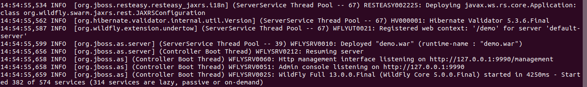
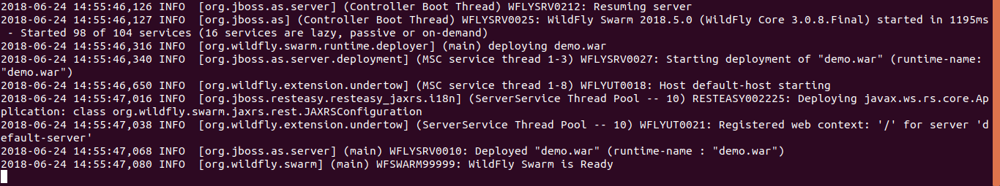

# Build a webapp with Wildlfy Swarm (Thorntail)

Open the jaxrs project and run:

`mvn wildfly-swarm:run`

Then go to:

`http://localhost:8080/hello`

Then see the message:

> Hello from WildFly Swarm!

## Results

From deploying the same application in the Wildfly Full Distribution and in as a self-contained jar in Wildfly Swarm Mode, we got the following results:

The main difference we see here, besides the fact that Wildfly full distribution naturally is taking a  bit longer to start, is the number of started services:

- Wildfly Full distribution logs show that **382 of 574 services** have been started
- Wildfly Swarm logs show that **98 of 104 services** have been started

This is obviously a huge difference and explain why the Wildfly Swarm deployment is quicker to start and feels more lightweight!